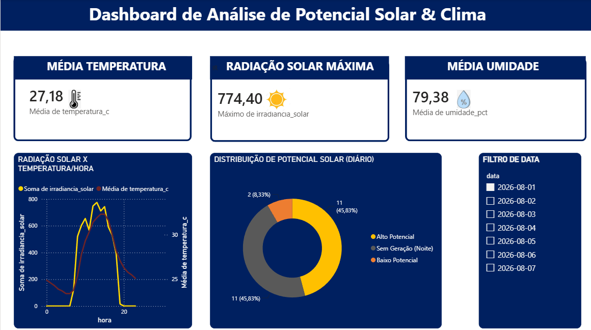
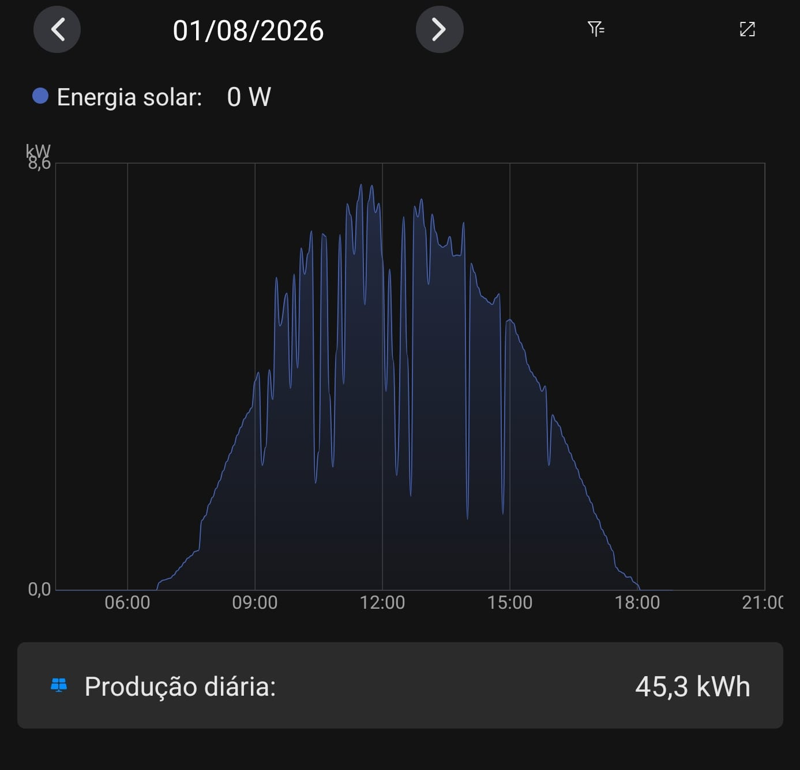

# ☀️ Análise de Potencial Solar vs. Geração Fotovoltaica Real (Belém-PA)

## 📌 Sobre o Projeto

Este projeto nasceu da ideia de validar se os dados meteorológicos públicos (radiação solar, temperatura e umidade) seriam capazes de prever com precisão a eficiência de geração de energia no mundo real. 

Para isso, construí uma pipeline de dados em Python para consumir a API REST da Open-Meteo para a região de Belém-PA e criei um dashboard no Power BI para a visualização. A validação prática do modelo foi feita comparando os indicadores climáticos simulados diretamente com os **relatórios de produção diária do meu próprio sistema fotovoltaico residencial (8.5 kW)**.

---

## ⚡ Validação Prática: Modelo Climático vs. Placas Solares

A grande virada analítica do projeto foi confrontar a teoria dos dados com a prática da geração solar real:

| Dashboard Climático (Power BI) | Relatório Real do Inversor |
| :---: | :---: |
|  |  |

* **Aderência da Curva:** A janela de pico de radiação prevista no dashboard (entre **10h e 15h**) coincide com o período de máxima geração registrada pelo aplicativo das placas.
* **Sensibilidade às Nuvens:** As oscilações bruscas no gráfico de produção real (efeito "dente de serra") refletem as flutuações instantâneas de cobertura de nuvens e umidade capturadas pelo modelo.

---

## 🏗️ Arquitetura da Pipeline de Dados
[🌐 API Open-Meteo] ➔ [🐍 Script ETL em Python] ➔ [💾 Exportação .CSV] ➔ [📊 Power BI & Validação Real]

1. **Extração de Dados:** Consumo automatizado via API REST meteorológica da Open-Meteo.
2. **Engenharia de Dados (Python):**
   * Tratamento de séries temporais com `pandas` (`time` $\rightarrow$ `data` e `hora`).
   * Renomeação e padronização de variáveis.
   * Aplicação de regra de negócio (`numpy.select`) para classificar o **Status de Potencial Solar** em *Alto Potencial*, *Baixo Potencial* e *Sem Geração (Noite)*.
3. **Visualização & BI (Power BI):**
   * Tratamento de regionalização/separadores decimais no Power Query.
   * Dashboard Dark Mode focado na experiência do usuário (UX).
   * **Eixo Y Secundário** no gráfico de linhas para cruzar a Irradiância Solar ($W/m^2$) com a Temperatura Média ($°C$).

---

## 🔍 Principais Insights

* **Máxima Irradiância:** A radiação solar atingiu o pico de **774,40 W/m²**.
* **Aproveitamento Operacional:** **45,83%** das horas monitoradas no dia apresentaram **Alto Potencial** de geração.
* **Produção Resultante:** A conjuntura climática analisada permitiu uma geração real diária de **41,5 kWh** no sistema fotovoltaico.

---

## 🛠️ Tecnologias Utilizadas

* **Linguagem & Bibliotecas:** Python (`pandas`, `numpy`, `requests`)
* **Business Intelligence:** Power BI (Power Query, DAX, UX/UI Design)
* **Fontes de Dados:** API REST (Open-Meteo Weather Forecast) & Inversor Fotovoltaico Residencial
