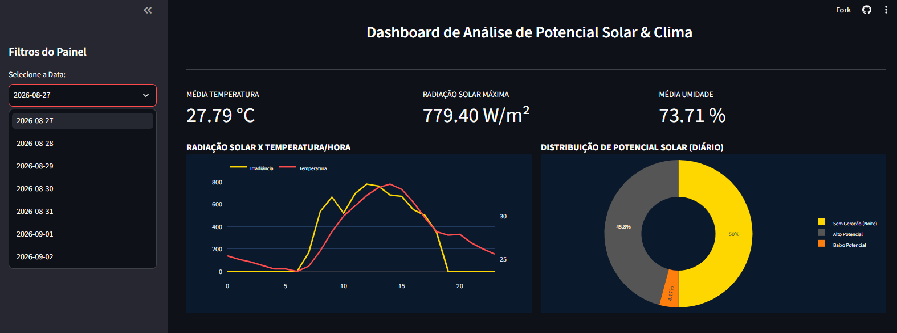

# ☀️ Análise de Potencial Solar vs. Geração Fotovoltaica Real (Belém-PA)


[](https://potencial-solar-belem-higor.streamlit.app/)


> **🔗 Acesse o Dashboard Online:** https://potencial-solar-belem-higor.streamlit.app/

## 📌 Sobre o Projeto

Este projeto nasceu da ideia de validar se os dados meteorológicos públicos (radiação solar, temperatura e umidade) seriam capazes de prever com precisão a eficiência de geração de energia no mundo real. 

Inicialmente, **estruturei um protótipo de validação utilizando Power BI** com arquivos locais para confrontar os indicadores climáticos com os relatórios de produção diária do meu próprio sistema fotovoltaico residencial (~8.5 kW). Com o sucesso da prova de conceito, evoluí o projeto para uma arquitetura de dados profissional e escalável: construí uma pipeline de ETL em Python consumindo a API da Open-Meteo, automatizei sua orquestração diária, armazenei os dados em um Data Warehouse na nuvem (**Google BigQuery**) e publiquei um Data App interativo e em tempo real utilizando **Streamlit** e **Plotly**.

---

## ⚡ Validação Prática: Evolução Visual do Projeto

Abaixo é possível acompanhar a evolução da interface e a validação do modelo com a geração real da residência:

| 1. Prototipagem (Power BI) | 2. Dashboard em Nuvem (Streamlit) | 3. Relatório Real do Inversor (Casa) |
| :---: | :---: | :---: |
|  |  |  |

* **Aderência da Curva:** A janela de pico de radiação prevista no modelo (entre **10h e 15h**) coincide perfeitamente com o período de máxima geração registrada pelo aplicativo das placas em casa.
* **Sensibilidade às Nuvens:** As oscilações bruscas no gráfico refletem as flutuações instantâneas de cobertura de nuvens e umidade capturadas pela API meteorológica.

---

## 🏗️ Arquitetura e Orquestração da Pipeline de Dados

Fluxo automatizado de engenharia de dados do projeto:

```mermaid
%%{init: {'theme': 'dark', 'themeVariables': { 'darkMode': true, 'background': '#0b192c', 'primaryColor': '#1e3a8a', 'primaryTextColor': '#fff', 'primaryBorderColor': '#ffd700', 'lineColor': '#ffd700', 'secondaryColor': '#1e293b', 'tertiaryColor': '#0f172a'}}}%%
graph TD
    A["🌐 API Open-Meteo<br>(Fonte Meteorológica)"] -->|Consumo Diário| B["⚙️ GitHub Actions<br>(Orquestração & ETL Python)"]
    B -->|Carga de Dados| C["☁️ Google BigQuery<br>(Data Warehouse na Nuvem)"]
    C -->|Consulta em Tempo Real| D["⚡ Streamlit App<br>(Dashboard Interativo)"]
